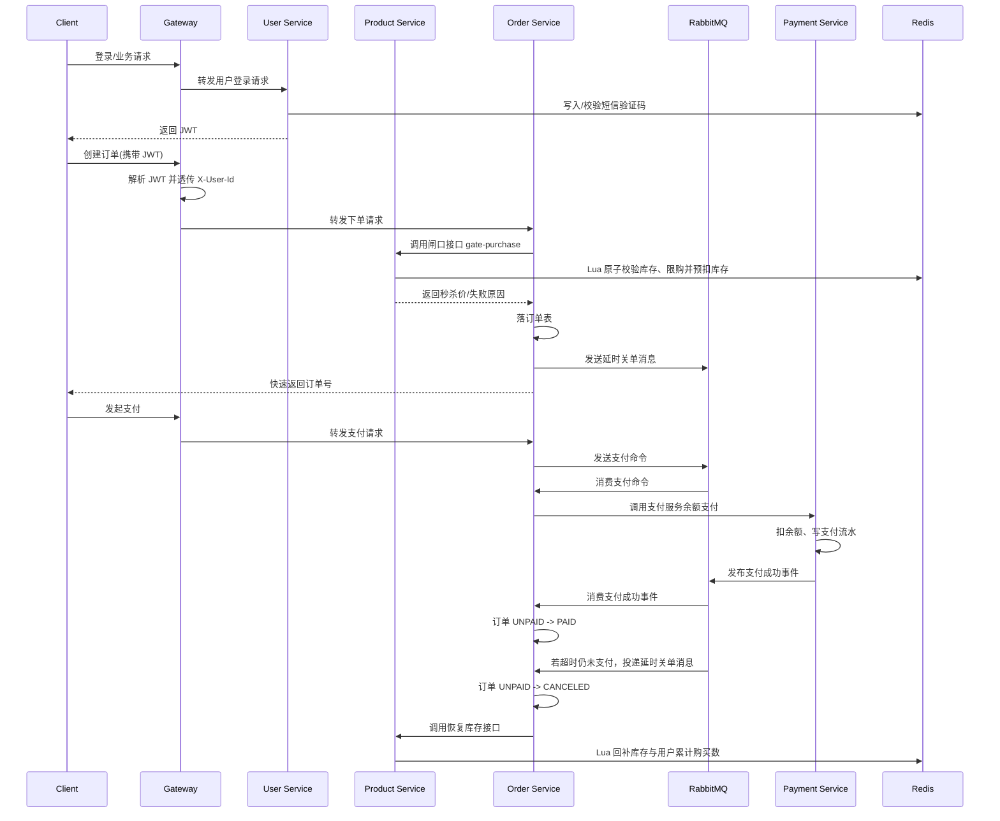

# flashsale-parent

一个基于 Spring Boot、Spring Cloud Alibaba、Nacos、Redis、RabbitMQ、MyBatis 的秒杀系统后端示例工程。

项目采用 Maven 多模块结构，按网关、用户、商品、订单、支付拆分服务，并抽出公共 DTO、Feign 契约、JWT 工具等共享模块。整体实现的重点是：

- 网关统一鉴权与路由
- Redis + Lua 做秒杀资格校验、库存预扣、限购累计
- 商品详情使用逻辑过期缓存，降低热点读取压力
- 订单创建后通过 RabbitMQ 实现异步支付与延时关单
- 支付成功通过事件驱动回写订单状态

## 1. 主链路流程

这一部分先讲系统最核心的业务链路，也就是一个用户从登录到抢购、支付、订单完成的大致过程。

### 1.1 总体时序



### 1.2 链路拆解

#### 步骤 1：用户登录

1. 客户端调用用户服务发送验证码接口。
2. 用户服务校验手机号格式。
3. 生成 6 位验证码写入 Redis，带过期时间。
4. 客户端携带手机号和验证码调用登录接口。
5. 用户服务校验验证码，通过后查找或创建用户。
6. 用户服务签发 JWT 返回给客户端。

关键实现点：

- 验证码存 Redis，而不是落库
- JWT 为无状态认证
- 登录成功后会删除验证码，降低重复使用风险

### 步骤 2：请求进入网关

1. 客户端后续请求携带 `Authorization` 头。
2. Gateway 解析 JWT。
3. 将用户上下文透传为 `X-User-Id` 等自定义请求头。
4. Gateway 按路径将请求路由到具体服务。

这样下游服务不需要重复解析 token，只依赖网关透传的用户上下文。

### 步骤 3：秒杀下单资格校验

1. 订单服务收到创建订单请求后，先不直接写订单。
2. 订单服务通过 Feign 调商品服务的 `gate-purchase` 接口。
3. 商品服务先从逻辑过期缓存读取商品快照。
4. 商品服务校验：
   - 商品是否存在
   - 商品状态是否在线
   - 是否处于活动开始/结束时间内
   - 单人限购数配置
5. 商品服务执行 Redis Lua 脚本，原子完成：
   - 库存是否充足
   - 当前用户累计购买数是否超限
   - 扣减库存
   - 增加用户累计购买数
6. 如果通过，商品服务将秒杀价返回给订单服务。

这里把高并发下最容易发生竞争的逻辑放到了 Redis + Lua 里，避免靠数据库行锁顶秒杀流量。

### 步骤 4：订单创建

1. 订单服务拿到秒杀价后生成订单号。
2. 计算订单总金额。
3. 插入订单表，初始状态为 `UNPAID`。
4. 事务提交后发送延时关单消息。
5. 订单服务立即返回订单号给前端。

这个阶段的特点是：

- 订单落库是同步的
- 支付不是同步阻塞在下单接口里
- 延时关单依赖 RabbitMQ 的延迟消息能力

### 步骤 5：支付

1. 客户端调用订单服务支付接口。
2. 订单服务发送支付命令消息到 RabbitMQ。
3. 订单服务消费者异步消费支付命令。
4. 消费者读取订单，校验：
   - 订单存在
   - 订单归属当前用户
   - 状态仍然是 `UNPAID`
5. 订单服务调用支付服务内部接口发起余额支付。
6. 支付服务执行：
   - 校验参数
   - 查询钱包账户
   - 校验余额
   - 乐观锁扣减余额
   - 插入支付流水
7. 支付服务在事务提交后发布“支付成功事件”。
8. 订单服务订阅支付成功事件，将订单状态改为 `PAID`。

这里采用“命令 + 事件”的模式：

- 支付命令是订单服务发起给支付服务的动作
- 支付成功事件是支付服务告诉订单服务结果

### 步骤 6：超时关单

1. 创建订单后，订单服务已经发送了延时关单消息。
2. 如果在超时时间内订单仍是 `UNPAID`，订单服务消费到超时消息后尝试关单。
3. 若关单成功，则调用商品服务回补库存。
4. 商品服务执行 Redis Lua 回补脚本：
   - 返还库存
   - 减少该用户该商品的累计购买数

这样就完成了“预扣库存 -> 下单占坑 -> 支付成功确认 / 超时回滚”的闭环。

## 2. 系统架构

### 2.1 模块划分

根工程为父 POM，多模块如下：

| 模块 | 说明 |
| --- | --- |
| `flashsale-gateway` | 网关，负责鉴权、请求转发、跨域等 |
| `flashsale-user-service` | 用户服务，负责短信验证码登录与用户查询 |
| `flashsale-product-service` | 商品服务，负责商品详情、上架、秒杀闸口、库存回补 |
| `flashsale-order-service` | 订单服务，负责订单创建、取消、支付命令、延时关单、支付事件消费 |
| `flashsale-payment-service` | 支付服务，负责余额支付与支付成功事件发布 |
| `flashsale-common-core` | 公共 DTO、异常、常量、工具类 |
| `flashsale-common-api` | 服务间调用的 Feign 契约 |
| `flashsale-common-security` | JWT 工具等安全相关公共能力 |

### 2.2 端口与服务名

| 模块 | 服务名 | 端口 |
| --- | --- | --- |
| Gateway | `flashsale-gateway-service` | `9000` |
| User Service | `flashsale-user-service` | `9010` |
| Product Service | `flashsale-product-service` | `9020` |
| Order Service | `flashsale-order-service` | `9030` |
| Payment Service | `flashsale-payment-service` | `9040` |

### 2.3 基础设施依赖

| 组件 | 用途 |
| --- | --- |
| MySQL | 订单、商品、用户、钱包持久化 |
| Redis | 验证码、商品缓存、秒杀库存、用户购买累计 |
| RabbitMQ | 支付命令、延时关单、支付成功事件、失败重试 |
| Nacos | 服务注册与发现 |

## 3. 项目目录结构

```text
flashsale-parent
├── flashsale-common-api
├── flashsale-common-core
├── flashsale-common-security
├── flashsale-gateway
├── flashsale-order-service
├── flashsale-payment-service
├── flashsale-product-service
├── flashsale-user-service
├── docker
│   ├── docker-compose.yml
│   ├── Dockerfile.rabbitmq
│   └── rabbitmq.conf
├── temp
│   ├── sql
│   └── script
└── wrk-test
```

## 4. 各模块详解

这一部分按模块展开，先说职责，再说关键代码，再说接口和运行要点。

## 4.1 flashsale-gateway

### 模块职责

- 系统统一入口
- 基于 JWT 做认证拦截
- 将用户身份透传给下游服务
- 根据路径规则路由到各微服务
- 配置跨域策略

### 关键配置

- 路由配置位于 `flashsale-gateway/src/main/resources/application.yaml`
- 认证过滤器位于 `flashsale-gateway/src/main/java/com/ye94z/gateway/filter/JwtAuthFilter.java`
- 启动类位于 `flashsale-gateway/src/main/java/com/ye94z/gateway/FlashsaleGatewayApplication.java`

### 对外路由

| 网关入口 | 转发目标 |
| --- | --- |
| `/api/user/**` | `flashsale-user-service` |
| `/api/products/**` | `flashsale-product-service` |
| `/api/orders/**` | `flashsale-order-service` |
| `/api/pay/**` | `flashsale-payment-service` |

### 鉴权逻辑

- 白名单接口直接放行
- 非白名单接口要求有 `Authorization`
- 解析成功后透传：
  - `X-User-Id`
  - `X-User-Nick`
  - `X-User-Icon`

### 适合关注的代码点

- `WHITE_LIST` 控制匿名访问接口
- `getOrder()` 返回 `-100`，保证过滤器较早执行
- 通过 `lb://` 配合 Nacos 走服务发现与负载均衡

## 4.2 flashsale-user-service

### 模块职责

- 发送短信验证码
- 短信验证码登录
- 自动创建新用户
- 返回 JWT

### 核心实现

主要类：

- `UserAuthController`
- `UserService`
- `UserServiceImpl`
- `UserAccountMapper`

### 关键业务

#### 发送验证码

- 校验手机号格式
- 生成随机数字验证码
- 存入 Redis
- 当前实现通过日志打印验证码，便于本地联调

#### 登录

- 校验手机号
- 校验 Redis 中验证码
- 根据手机号查用户
- 不存在则自动创建用户
- 生成 JWT 返回

### 对外接口

| 方法 | 路径 | 说明 |
| --- | --- | --- |
| `POST` | `/user/send-code?phone=` | 发送验证码 |
| `POST` | `/user/login` | 验证码登录 |
| `GET` | `/user/{id}` | 查询用户 |

### 存储依赖

- MySQL：用户表
- Redis：登录验证码

## 4.3 flashsale-product-service

### 模块职责

- 提供商品详情查询
- 商品上架
- 秒杀闸口校验
- 维护 Redis 实时库存
- 处理取消/超时后的库存回补

### 核心实现

主要类：

- `ProductController`
- `ProductService`
- `ProductServiceImpl`
- `FlashProductMapper`
- `CacheClient`
- `RedissonConfig`

### 设计重点

#### 1. 商品详情缓存

商品详情查询走逻辑过期缓存：

- 首次查询缓存未命中时回源 DB 并回填
- 热点 key 过期后优先返回旧值
- 后台异步刷新缓存
- 使用互斥锁避免缓存击穿
- 对空值做短 TTL 缓存，避免缓存穿透

#### 2. 秒杀闸口

下单前通过 `gate-purchase` 接口完成资格校验，不直接依赖数据库库存扣减。

Lua 脚本原子完成：

- 判断库存是否足够
- 判断当前用户购买数是否超过限制
- 扣减库存
- 增加用户累计购买数

Lua 文件：

- `src/main/resources/lua/flash_gate.lua`
- `src/main/resources/lua/restore_stock.lua`

#### 3. 上架逻辑

商品上架时会：

- 将商品状态改为在线
- 事务提交后将库存预热到 Redis
- 刷新商品缓存

### 对外接口

| 方法 | 路径 | 说明 |
| --- | --- | --- |
| `POST` | `/products/gate-purchase` | 秒杀闸口校验并预扣库存 |
| `GET` | `/products/{id}` | 查询商品详情 |
| `POST` | `/products/{id}/on-sale` | 商品上架并预热库存 |
| `POST` | `/products/update` | 更新商品 |
| `POST` | `/products/stock/restoreStock` | 回补库存与购买累计 |

### Redis 中的数据角色

| Key 前缀 | 含义 |
| --- | --- |
| `cache:product:` | 商品逻辑过期缓存 |
| `lock:product:` | 商品缓存重建锁 |
| `flash:stock:` | 商品实时库存 |
| `flash:buy:` | 用户购买累计 Hash |

## 4.4 flashsale-order-service

### 模块职责

- 创建订单
- 发送支付命令
- 手动取消订单
- 发送延时关单消息
- 消费支付成功事件
- 在取消或超时后恢复库存

### 核心实现

主要类：

- `OrderCommandController`
- `OrderQueryController`
- `OrderService`
- `OrderServiceImpl`
- `OrderCommandProducer`
- `OrderCommandConsumer`
- `PaymentEventConsumer`
- `FlashOrderMapper`
- `OrderMqConfig`
- `PaymentEventMqConfig`

### 下单逻辑

订单服务的职责并不是自己判断库存，而是“编排”整个下单过程：

1. 调商品服务闸口接口
2. 获取秒杀价
3. 生成订单 ID
4. 插入订单表
5. 发送延时关单消息

### 支付逻辑

支付请求不是同步扣款，而是：

1. 接口层收到支付请求
2. 投递支付命令消息
3. MQ 消费者读取订单并调用支付服务
4. 支付成功后等待支付事件回写订单状态

### 延时关单逻辑

订单创建后会发送带延迟时间的消息。若订单一直未支付：

- 更新订单状态为 `CANCELED`
- 调商品服务恢复库存
- 释放该用户的购买累计

### MQ 设计

订单服务是当前系统消息流最重的模块，主要包含：

#### 命令交换机

- `order.cmd.ex`
  - `order.cancel`
  - `order.pay`

#### 延时交换机

- `order.delay.ex`
  - `order.timeout`

#### 全局死信/重试

- `order.dlx.ex`
- `order.q.dlt`

主队列消费失败后，先进入统一 DLX，再转入各自重试队列，TTL 到期后回原交换机和路由键，再次投递。达到一定次数后进入最终失败队列。

### 对外接口

| 方法 | 路径 | 说明 |
| --- | --- | --- |
| `POST` | `/orders` | 创建订单 |
| `POST` | `/orders/{orderId}/cancel` | 主动取消订单 |
| `POST` | `/orders/{orderId}/pay` | 发起支付 |
| `GET` | `/api/orders/{orderId}` | 查询订单详情 |
| `GET` | `/api/orders/my` | 查询我的订单列表 |

### 当前代码现状

- 创建、取消、支付主链路已实现
- 查询接口的方法入口已预留，但服务层查询逻辑仍返回“未实现”
- 支付成功事件消费已实现

## 4.5 flashsale-payment-service

### 模块职责

- 钱包余额支付
- 支付流水落库
- 支付成功事件发布

### 核心实现

主要类：

- `PaymentCommandController`
- `PaymentService`
- `PaymentServiceImpl`
- `WalletAccountMapper`
- `WalletTxnMapper`
- `PaymentEventProducer`
- `PaymentMqConfig`

### 支付实现要点

#### 1. 幂等检查

支付前先查订单号对应支付流水：

- 若已存在成功流水，则视为已支付
- 避免重复扣款

#### 2. 乐观锁扣余额

钱包余额扣减使用账户版本号控制并发冲突：

- 读取钱包账户
- 比较余额是否充足
- 尝试按版本号更新余额
- 失败则重新读取并重试

#### 3. 发布支付成功事件

支付流水插入成功后，在事务提交后发布支付成功事件，避免出现“事务回滚了但事件发出去了”的问题。

### 对外接口

当前控制器中已实现：

| 方法 | 路径 | 说明 |
| --- | --- | --- |
| `POST` | `/internal/payments/pay` | 内部余额支付 |

说明：

- `common-api` 中定义了 `refund` Feign 接口
- 当前 `payment-service` 控制器中尚未提供对应退款实现

## 4.6 flashsale-common-core

### 模块职责

- 公共返回模型
- 公共 DTO
- 枚举与常量
- 业务异常与断言
- 通用工具类

### 典型内容

- `Result`
- `ProductDTO`
- `PaymentPaidEventDTO`
- `OrderStatus`
- `PayType`
- `RedisConstants`
- `SnowflakeIdGenerator`
- `BizException`

这是各服务共同依赖的最底层业务基础模块，尽量避免引入重量级框架依赖。

## 4.7 flashsale-common-api

### 模块职责

- 封装服务间调用契约
- 统一 Feign 接口定义
- 降低服务间重复写请求路径和参数的成本

### 当前内容

- `ProductApiClient`
- `PaymentApiClient`
- `FeignCommonConfig`

其中订单服务通过该模块调用：

- 商品服务的闸口、商品详情、恢复库存接口
- 支付服务的支付接口

## 4.8 flashsale-common-security

### 模块职责

- 提供 JWT 生成、解析、刷新工具

### 当前内容

- `JwtUtils`

主要能力：

- 生成 token
- 解析 token
- 判断是否即将过期
- 在窗口期内刷新 token

## 5. 数据模型

项目中 `temp/sql` 给出了核心表定义，主要包括以下几类：

### 5.1 用户域

- `user_account`

字段重点：

- `phone`
- `nickname`
- `avatar_url`
- `status`

### 5.2 商品域

- `flash_product`

字段重点：

- `flash_price_cents`
- `origin_price_cents`
- `stock`
- `sold`
- `limit_per_user`
- `start_time`
- `end_time`
- `status`

### 5.3 订单域

- `flash_order`

字段重点：

- `id`
- `user_id`
- `product_id`
- `quantity`
- `pay_amount_cents`
- `status`
- `pay_txn_id`
- `create_time`
- `pay_time`
- `close_time`

订单状态约定：

| 值 | 含义 |
| --- | --- |
| `1` | UNPAID |
| `2` | PAID |
| `3` | FULFILLED |
| `4` | CANCELED |
| `5` | REFUNDING |
| `6` | REFUNDED |

### 5.4 支付域

- `pay_wallet_account`
- `pay_wallet_txn`

其中：

- 钱包账户表记录余额和版本号
- 钱包流水表记录每次订单支付对应的资金变动

## 6. Redis 设计

Redis 在这个项目里不只是缓存，还承担了高并发秒杀闸口的关键职责。

### 6.1 验证码

- `login:code:{phone}`

作用：

- 保存登录验证码
- 设置短 TTL

### 6.2 商品缓存

- `cache:product:{id}`

作用：

- 保存逻辑过期包装后的商品详情

### 6.3 缓存锁

- `lock:product:{id}`

作用：

- 热点缓存重建互斥锁

### 6.4 秒杀库存

- `flash:stock:{productId}`

作用：

- 保存 Redis 中的剩余库存

### 6.5 用户购买累计

- `flash:buy:{productId}`

作用：

- Hash 结构，field 为 `userId`
- value 表示该用户当前已占用或已购买的数量

## 7. RabbitMQ 设计

### 7.1 订单命令消息

用途：

- 主动取消订单
- 发起支付

### 7.2 延时关单消息

用途：

- 订单超时未支付时自动取消

依赖：

- RabbitMQ 延迟消息插件
- 项目中通过自定义镜像构建

### 7.3 支付成功事件

用途：

- 由支付服务发出
- 由订单服务消费
- 最终完成订单支付状态更新

### 7.4 重试和死信

思路：

- 主队列失败后进入统一 DLX
- 再进入各自重试队列
- TTL 到期回原交换机
- 多次失败后进入最终 DLT 留痕

这套策略的好处是：

- 消费者逻辑里只需区分可重试和不可重试
- 队列结构统一，排障比较直观

## 8. 本地开发与启动

## 8.1 环境要求

建议环境：

- JDK 21
- Maven 3.9+
- Docker / Docker Compose

说明：

- 父工程配置使用 Java 21
- `flashsale-order-service` 的编译插件里单独写了 `source/target 17`
- 实际本地运行时建议优先统一到同一版本的 JDK

## 8.2 启动基础设施

在项目根目录执行：

```bash
cd docker
docker compose up -d
```

会启动：

- MySQL 8.4
- Redis 7
- RabbitMQ 3.13（带 delayed message 插件）
- Nacos 2.5

默认端口：

- MySQL: `3306`
- Redis: `6379`
- RabbitMQ AMQP: `5672`
- RabbitMQ 管理台: `15672`
- Nacos: `8848`

## 8.3 初始化数据库

项目中没有独立拆分好的 SQL 初始化目录，当前可参考：

- `temp/sql`

建议按业务拆成：

- `fs_user`
- `fs_product`
- `fs_order`
- `fs_payment`

并将对应表初始化到各自数据库中。

## 8.4 启动服务

可以直接在 IDEA 中分别启动各模块启动类，也可以使用 Maven。

建议启动顺序：

1. `flashsale-user-service`
2. `flashsale-product-service`
3. `flashsale-payment-service`
4. `flashsale-order-service`
5. `flashsale-gateway`

示例命令：

```bash
mvn -pl flashsale-user-service spring-boot:run
mvn -pl flashsale-product-service spring-boot:run
mvn -pl flashsale-payment-service spring-boot:run
mvn -pl flashsale-order-service spring-boot:run
mvn -pl flashsale-gateway spring-boot:run
```

## 8.5 样例联调流程

### 1. 发送验证码

```bash
curl -X POST "http://localhost:9000/api/user/send-code?phone=13800000000"
```

### 2. 登录获取 token

```bash
curl -X POST "http://localhost:9000/api/user/login" \
  -H "Content-Type: application/json" \
  -d '{"phone":"13800000000","code":"123456"}'
```

### 3. 商品上架

```bash
curl -X POST "http://localhost:9000/api/products/1/on-sale" \
  -H "Authorization: Bearer <TOKEN>"
```

### 4. 创建订单

```bash
curl -X POST "http://localhost:9000/api/orders" \
  -H "Authorization: Bearer <TOKEN>" \
  -H "Content-Type: application/json" \
  -d '{"productId":1,"quantity":1}'
```

### 5. 发起支付

```bash
curl -X POST "http://localhost:9000/api/orders/<ORDER_ID>/pay" \
  -H "Authorization: Bearer <TOKEN>"
```

## 9. 压测与辅助脚本

项目中额外提供了一些辅助目录：

### `wrk-test`

包含 wrk 压测脚本，例如：

- `gate.lua`
- `order_create.lua`

### `temp/script`

包含生成随机用户、随机商品的脚本。

### `temp/old`

包含一些旧实现或历史备份代码，阅读主逻辑时可以忽略。

## 10. 当前实现的优点

从工程设计上看，这个项目已经体现出比较完整的秒杀系统雏形：

- 不是简单单体 CRUD，而是有明确服务边界
- 高并发热点路径下沉到 Redis + Lua
- 订单与支付通过消息解耦
- 考虑了幂等、延时关单、支付成功事件回写
- 引入逻辑过期缓存，兼顾热点性能与可用性

## 11. 当前已知现状与注意事项

这部分不是项目缺陷清单，而是阅读和联调时最好提前知道的现状。

### 11.1 README 所依据的是当前代码现状

文档优先反映当前仓库已有实现，不假设未提交的功能已经完成。

### 11.2 订单查询接口尚未真正完成

`OrderQueryController` 已暴露查询接口，但 `OrderServiceImpl` 中：

- `getDetail`
- `listMyOrders`

目前仍返回“未实现”。

### 11.3 查询控制器路径与网关转发规则存在不一致

网关会把 `/api/orders/**` 转发到订单服务并 `StripPrefix=1`，因此下游服务通常应接收 `/orders/**`。

但当前 `OrderQueryController` 使用的是：

```java
@RequestMapping("/api/orders")
```

这意味着查询接口在网关联调时需要特别关注路径是否匹配预期。

### 11.4 JWT claims 字段名存在不一致

用户服务生成 token 时写入的是：

- `nickname`
- `avatarUrl`

而网关过滤器读取的是：

- `nickName`
- `icon`

这会影响昵称和头像透传，但 `userId` 仍然是主链路里最关键的字段。

### 11.5 配置中包含本地明文密码和密钥

当前仓库中的 `application.yaml` 与 `JwtUtils` 中直接写了：

- MySQL 用户名密码
- Redis、Nacos 地址
- JWT Secret

本地实验方便，但如果后续演进到团队开发或部署环境，建议迁移到环境变量或配置中心。

### 11.6 `common-api` 中已有退款契约，但支付服务尚未实现退款接口

这说明退款能力设计已经预留，但业务还未闭环。

## 12. 后续可演进方向

如果继续完善，这个项目后面比较值得做的方向包括：

1. 完成订单查询、分页与用户归属校验
2. 增加退款链路与支付逆向流程
3. 增加商品售卖成功后的数据库库存对账与异步落库策略
4. 为各服务补充单元测试、集成测试和接口测试
5. 把库表初始化脚本整理为正式迁移脚本
6. 引入配置中心、日志追踪和监控告警
7. 统一 token claims 命名、接口路径命名和 Java 版本配置

## 13. 一句话总结

这是一个围绕“秒杀资格校验、异步订单流转、支付事件驱动”搭起来的微服务后端工程。它已经具备一条较完整的主业务链路，适合作为学习型项目、课程设计、个人微服务练手项目，或者作为后续继续补全的秒杀系统骨架。
